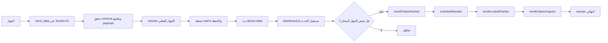

# التوثيق النظري الشامل لمنظومة السبيكتوغرام

هذا الملف هو المرجع التفسيري الأعلى لمنظومة العرض الطيفي في المشروع. الهدف منه ليس إعطاء وصف سريع، بل بناء فهم معماري عميق يربط بين:

- مصدر البيانات القادم من الجهاز.
- طبقة التحقق والحفظ والاسترجاع.
- طبقة الداشبورد التي تدير الحالة والواجهات والتفاعل.
- محرك الرسم الذي يحول المصفوفات الرقمية إلى صورة سبيكتوغرام قابلة للقراءة.

الشرح أدناه موجه ليفسّر سلوك الكود الموجود فعلًا في المشروع، لا تصورًا نظريًا عامًا فقط. لذلك ستجد هنا تفصيلًا للبنية، والأنواع، ومسار الإرسال، وآلية الرسم، وكيفية دمج الباكتات الجديدة مباشرة في المشهد المرئي، وآليات البان والزوم، وتبديل الجهاز، وجلب سجل جهاز جديد، وشرحًا وظيفيًا لأقسام كود الداشبورد والسبيكتوغرام.

---

## 1) الخلاصة التنفيذية

النظام يعمل على مبدأ بسيط في الظاهر، لكنه دقيق في التطبيق:

1. الجهاز يرسل باكت جديدة تحتوي مصفوفة طيفية ثنائية الأبعاد.
2. الخادم يتحقق من الباكت، يطابق الجهاز، ثم يحفظ البيانات مضغوطة في قاعدة البيانات.
3. الخادم يبث الباكت بعد معالجتها إلى الواجهة عبر Socket.IO.
4. واجهة الداشبورد تلتقط الحدث، تتحقق هل الباكت تخص الجهاز المختار، ثم تضيفها إلى الذاكرة الحالية.
5. محرك السبيكتوغرام يعيد الرسم فورًا على نفس الـ canvas، بحيث تظهر الباكت الجديدة مندمجة داخل المشهد القديم مباشرة.
6. أدوات البان والزوم تغيّر نافذة العرض فقط، لا تغيّر البيانات الأصلية.
7. تبديل الجهاز يعيد تحميل تاريخ الجهاز الجديد ثم يعيد بناء المشهد من الصفر على أساس الجهاز المختار.

النقطة الأهم هنا هي أن الرسم ليس صورة ثابتة لكل باكت، بل طبقة زمنية مدمجة من عدة باكتات مرصوصة على محور الزمن وفق مجالاتها الزمنية الحقيقية.

---

## 2) خريطة الملفات التي تشكّل المنظومة

### الملفات الأساسية في التوثيق

- [src/public/js/spectrogram.js](../src/public/js/spectrogram.js) محرك الرسم نفسه.
- [src/public/js/dashboard.js](../src/public/js/dashboard.js) المتحكم بالحالة والتفاعلات وجلب البيانات الحية.
- [src/sockets/device.socket.ts](../src/sockets/device.socket.ts) نقطة استقبال الباكت من الجهاز عبر السوكت.
- [src/services/history.service.ts](../src/services/history.service.ts) طبقة التطبيع والحفظ والاسترجاع.
- [src/utils/types.ts](../src/utils/types.ts) تعريفات البنية والأنواع.
- [src/utils/validation.ts](../src/utils/validation.ts) قواعد التحقق من الصحة.
- [src/views/dashboard.ejs](../src/views/dashboard.ejs) الواجهة التي تحتوي عناصر التحكم والكانفس.

### الملفات المساندة ذات الصلة

- [src/entities/DeviceHistory.ts](../src/entities/DeviceHistory.ts) يمثل سجل تاريخ الباكتات.
- [src/entities/Device.ts](../src/entities/Device.ts) يمثل الجهاز نفسه.
- [src/services/device.service.ts](../src/services/device.service.ts) حلّ الجهاز من المعرّف أو الاسم.

---

## 3) العقدة المفاهيمية للبيانات

البيانات تمر بعدة طبقات تمثيل:

### 3.1) ما يرسله الجهاز

الحمولة قد تحتوي عادةً على:

- `deviceId`: رقم أو نص يميز الجهاز.
- `timestamp`: لحظة مرجعية.
- `startTime` أو `start_time`: بداية نافذة الباكت.
- `endTime` أو `end_time`: نهاية نافذة الباكت.
- `data`: مصفوفة ثنائية الأبعاد من القيم العددية.

### 3.2) ما يخزنه الخادم

الخادم يحول المصفوفة إلى صيغة مضغوطة من نوع gzip + base64 عندما يكتبها في قاعدة البيانات، ثم يفكها عند القراءة.

### 3.3) ما يعرضه الداشبورد

واجهة الداشبورد لا تعرض مجرد timestamp واحد. بل تعرض سجلًا زمنيًا كاملًا يتكون من باكتات متجاورة أو متداخلة أو تحتوي فجوات، ويتم إسقاط كل باكت على نافذة زمنية لها بداية ونهاية صريحة.

### 3.4) ما يرسمه محرك السبيكتوغرام

محرك الرسم يقرأ `blocks`، ثم يترجم كل قيمة داخل المصفوفة إلى لون في موقع يحدده صف التردد وعمود الزمن داخل الباكت.

---

## 4) شكل البيانات والعقود الرسمية

### 4.1) أنواع البيانات في [src/utils/types.ts](../src/utils/types.ts)

النظام يعرّف عدة عقود مهمة:

- `DeviceMatrix = number[][]` وهي المصفوفة الطيفية الخام.
- `CompressedDeviceMatrixPayload` وهي النسخة المضغوطة المخزنة.
- `StoredDeviceMatrix` وهي اتحاد بين المصفوفة الخام والمضغوطة.
- `IncomingDeviceDataPayload` وهي الحمولة القادمة من الجهاز.
- `DeviceDataBroadcastPayload` وهي الحمولة بعد التطبيع والبث للواجهة.

### 4.2) معنى الحقول الأساسية

- `deviceId`: قد يكون رقمًا أو نصًا، لأن النظام يدعم الجهاز المعرّف برقم أو بوسم نصي.
- `timestamp`: يمثل النقطة الزمنية المرجعية الأساسية.
- `startTime` و `endTime`: تحددان المجال الزمني الفعلي للباكت.
- `data`: المصفوفة الرقمية ذات الأبعاد الثنائية.
- `persisted`: يحدد هل نجح الحفظ في قاعدة البيانات أم لا.

### 4.3) لماذا هناك أكثر من اسم للحقل الزمني

النظام يقبل `start_time` و `startTime`، وكذلك `end_time` و `endTime`، لأن بيانات الأجهزة قد تأتي من مصادر مختلفة أو بإصدارات إرسال مختلفة. ثم يقوم الخادم بتوحيدها إلى نموذج داخلي متسق.

---

## 5) التحقق من البيانات قبل الحفظ

### 5.1) التحقق العام في [src/utils/validation.ts](../src/utils/validation.ts)

التحقق يتأكد من أن:

- الحمولة كائن وليست قيمة بدائية.
- `deviceId` صالح.
- `timestamp` صالح.
- `data` مصفوفة ثنائية الأبعاد غير فارغة.
- كل عنصر في المصفوفة رقم حقيقي finite.
- `startTime` و `endTime` صالحان زمنيًا.
- `startTime` لا يتجاوز `endTime`.

### 5.2) الهدف من التحقق

الغرض ليس فقط رفض الإدخال السيئ، بل حماية ثلاث طبقات:

1. سلامة قاعدة البيانات.
2. سلامة محرك الرسم من المصفوفات المكسورة.
3. سلامة تجربة المستخدم في الواجهة عندما تُحدّث البيانات مباشرة.

### 5.3) لماذا يرفض النظام القيم غير finite

السبيكتوغرام يعتمد على تحويل كل قيمة إلى لون عبر تطبيع عددي. إذا دخلت `NaN` أو `Infinity` أو قيم غير عددية، فإن خريطة الألوان والـ canvas ستفقد الثبات البصري أو تنتج نتائج غير قابلة للتفسير.

---

## 6) مسار استقبال البيانات من الجهاز

### 6.1) بوابة السوكت في [src/sockets/device.socket.ts](../src/sockets/device.socket.ts)

هذا الملف هو أول نقطة التقاء مع الجهاز الخارجي. منطق التعامل معه كالتالي:

1. عند اتصال العميل عبر Socket.IO يتم تسجيل المستمعين.
2. عند وصول حدث `send_data` يتم التقاط payload.
3. يتم فحص ما إذا كانت الحمولة نصًا JSON أو كائنًا مباشرًا.
4. إذا كانت نصًا، يحاول النظام تحليلها إلى JSON.
5. إذا كانت فارغة أو غير صالحة، يتم إرجاع ack بخطأ.
6. إذا كانت صالحة، تُمرر إلى خدمة التاريخ للحفظ.
7. عند النجاح، يُبث `device:data` إلى الجميع.
8. عند الفشل في الحفظ، يتم محاولة إنشاء payload بث حي fallback ثم بثه أيضًا حتى لا يتوقف العرض.

### 6.2) لماذا يوجد fallback live payload

هذا جزء مهم جدًا من التصميم. الفكرة أن فشل الحفظ لا يعني بالضرورة أن العرض الحي يجب أن يتوقف. لذلك:

- إذا نجح الحفظ: الباكت تُبث مع `persisted: true`.
- إذا فشل الحفظ: يتم محاولة بناء payload حي غير محفوظ (`persisted: false`) ثم بثه.

هذه السياسة تحافظ على الاستمرارية البصرية حتى عند وجود مشكلة مؤقتة في قاعدة البيانات.

### 6.3) ماذا يعني بث `device:data`

هذا هو الحدث الذي تستمع له الواجهة. عند وصوله، لا يتم استبدال الرسم بالكامل بصورة منفصلة لكل باكت، بل يتم تحديث الحالة الداخلية ثم إعادة الرسم على نافذة العرض الحالية.

---

## 7) طبقة التاريخ والحفظ

### 7.1) ماذا تفعل [src/services/history.service.ts](../src/services/history.service.ts)

هذه الطبقة هي المسؤولة عن تحويل البيانات الخام القادمة من الجهاز إلى شكل صالح للتخزين والاسترجاع والعرض. وظيفتها تنقسم إلى أربع مهام:

1. تطبيع الحمولة القادمة.
2. ضغط المصفوفة قبل التخزين.
3. فك الضغط عند الاسترجاع.
4. تقديم البيانات للسوكت ولواجهة الاستعلام التاريخي.

### 7.2) ضغط المصفوفة

عند الحفظ، المصفوفة `number[][]` تُحوّل أولًا إلى JSON نصي، ثم تُضغط بـ gzip، ثم تُحوّل إلى base64. والنتيجة كائن يحتوي:

- `format: gzip-base64-json-v1`
- `rows`
- `cols`
- `payload`

هذا يقلل حجم التخزين ويجعل البنية قابلة للتوسعة مستقبلًا.

### 7.3) فك الضغط عند القراءة

عند الاسترجاع، الخدمة:

1. تتحقق هل البيانات مضغوطة أم لا.
2. إذا كانت مضغوطة، تفك base64 ثم gzip.
3. تعيد JSON إلى مصفوفة.
4. تتحقق مرة أخرى من صلاحية المصفوفة قبل تسليمها.

### 7.4) التطبيع الزمني

الخدمة تشتق القيم الزمنية النهائية بهذا المعنى:

- `timestamp` = المرجع الزمني الأساسي.
- `startTime` = بداية المجال الحقيقي.
- `endTime` = نهاية المجال الحقيقي.

وإذا كانت البداية والنهاية معكوسة، يتم رفض الحمولة.

### 7.5) حفظ سجل التاريخ

عند `saveIncomingDeviceData` يتم إنشاء كيان جديد في جدول التاريخ، مع:

- `deviceId` بعد حلّه إلى جهاز فعلي.
- `timestamp` = نهاية الباكت.
- `startTime` و `endTime`.
- `data` بعد الضغط.

ثم يرجع Payload صالح للبث يحتوي المصفوفة الخام لتمكين العرض المباشر على الواجهة.

---

## 8) فهم المصفوفة الطيفية بعمق

### 8.1) ما الذي تمثله المصفوفة

المصفوفة الطيفية هي خريطة كثافة رقمية. كل عنصر فيها يمثّل شدة إشارة في نقطة معينة من الزمن والتردد.

### 8.2) البنية الثنائية

الترميز المفاهيمي هو:

```text
matrix[row][col]
```

حيث:

- `row` = bin ترددي أو مستوى تردد.
- `col` = خطوة زمنية داخل الباكت.

### 8.3) لماذا الصفوف لا تُرسم بترتيبها الخام

في الصورة، الإنسان يتوقع أن الترددات الأعلى تكون في الأعلى بصريًا. لذلك يقوم محرك الرسم بعكس محور الصفوف بحيث يبدو التردد الأعلى في أعلى اللوحة.

### 8.4) القيمة الرقمية نفسها

القيمة قد تكون:

- شدة طيفية.
- طاقة نسبية.
- قياسًا طيفيًا مُطبّعًا.

المهم أن المحرك لا يفرض تفسيرًا فيزيائيًا صارمًا على الرقم. هو يعامله كـ intensity value ويحوّله إلى لون.

---

## 9) محرك الرسم: [src/public/js/spectrogram.js](../src/public/js/spectrogram.js)

هذا الملف هو قلب السبيكتوغرام البصري. وهو مكتوب على شكل IIFE ويُصدّر كائنًا واحدًا على `window.Spectrogram`.

### 9.1) فلسفة المحرك

المحرك لا يعتمد على إطار عمل. هو متعمد أن يكون بسيطًا، سريعًا، ومباشرًا:

- لا state framework.
- لا virtual DOM.
- لا طبقات إخفاء زائدة.
- الرسم يتم مباشرة على canvas.

### 9.2) الإعدادات الافتراضية `DEFAULT_CONFIG`

هذه الإعدادات تتحكم في شكل الصورة:

- `matrixOrientation: "frequency-time"`
- `blockTimestampMode: "end"`
- `colorMap: "magma"`
- `inputValueMax: 255`
- `gamma: 1.0`
- `smoothVertical: true`
- `background: "#140d28"`
- `gapFill` و `gapStroke`
- `axisColor` و `gridColor` و `textColor`
- `maxFastColumnStride`

### 9.3) معنى `matrixOrientation`

عندما تكون `frequency-time` فهذا يعني أن المصفوفة الداخلية تُقرأ على صورة:

- الصفوف = تردد.
- الأعمدة = زمن.

ولو تغيّر الاتجاه إلى `time-frequency`, فإن سلوك القراءة والـ indexing ينعكس. لكن في المشروع الحالي القيمة الافتراضية هي `frequency-time`، وهذا هو المسار الفعلي.

### 9.4) معنى `blockTimestampMode: "end"`

إذا لم تكن هناك بداية ونهاية صريحـتان للباكت، يستخدم المحرك timestamp كمرجع. وعندما تكون هذه القيمة `end`، يتم افتراض أن timestamp يمثّل نهاية النافذة، ثم يبني المحرك بداية تقديرية إلى الخلف.

هذا مهم في البيانات القديمة أو في البيانات التي تأتي فقط بعلامة زمنية واحدة.

### 9.5) خريطة الألوان

المحرك يدعم حاليًا خريطتين:

- `magma`
- `sunset`

#### `magma`

هي الخريطة الافتراضية. تبدأ من قيم داكنة جدًا قريبة من الأسود البنفسجي، ثم تتدرج إلى أرجواني، فقرمزي، ثم إلى أصفر فاتح عند أعلى الشدة.

#### `sunset`

خريطة أكثر دفئًا، تتدرج من الأزرق الداكن إلى أرجواني ثم برتقالي ثم ذهبي.

### 9.6) التطبيع العددي `normalizeIntensity`

المحرك يحتاج أن يحوّل القيمة الخام إلى نطاق بين 0 و 1 قبل إسقاطها على الألوان.

المنطق كالتالي:

- إذا كانت القيمة بين 0 و 1، تُعامل كما هي بعد القص إلى المجال [0,1].
- إذا كانت أكبر من 1، تُقسم على `inputValueMax`، والافتراضي 255.
- بعدها تُقص على المجال [0,1].

### 9.7) دور `gamma`

`gamma` يعيد تشكيل توزيع الألوان. عندما تكون 1.0 يكون التدرج خطيًا تقريبًا. لو زادت أو نقصت، يتغير الإحساس البصري:

- Gamma أعلى: يبرز القيم العالية بصورة أكبر.
- Gamma أقل: يجعل القيم المنخفضة أوضح نسبيًا.

### 9.8) التحويل من القيمة إلى اللون `valueToColor`

الخطوات هي:

1. تطبيع القيمة إلى 0..1.
2. رفعها إلى قوة `gamma`.
3. البحث في نقاط التوقف color stops.
4. إجراء interpolation خطي بين نقطتين متجاورتين.
5. إخراج `rgb` نهائي.

بالتالي كل نقطة في السبيكتوغرام هي نتيجة عملية interpolation عددية وليست اختيار لون ثابت فقط.

### 9.9) لماذا `magma` مناسبة بصريًا

لأنها تميل إلى إبراز الكثافات العالية بألوان ساخنة واضحة، مع احتفاظ الخلفيات الضعيفة بتفاصيل كافية دون أن تنطفئ البنية كاملة. وهذا مناسب جدًا للسبيكتوغرام لأن المشهد عادة يحتوي على مناطق ضعيفة ومناطق قوية في نفس الإطار.

---

## 10) كيف يترجم المحرك المصفوفة إلى صورة

### 10.1) البنية الهندسية للرسم

المحرك لا يرسم كل خلية بعرضها الفعلي بشكل مباشر فقط، بل يبني صورة داخلية native ثم يمدّها على مساحة العرض.

الخطوات الهندسية:

1. حساب أبعاد الـ canvas مع مراعاة DPR.
2. تحديد منطقة الرسم plot area مع هوامش للمحاور.
3. إنشاء canvas داخلي بعدد صفوف يساوي عدد bins.
4. ملء imageData بالقيم اللونية.
5. رسم canvas الداخلي على canvas الرئيسي مع smoothing عمودي إذا لزم.

### 10.2) لماذا توجد طبقة nativeCanvas

السبب هو التحكم في الجودة والأداء. بدلًا من رسم كل خلية مباشرة على canvas النهائي، يتم إنتاج طبقة داخلية ثم تكبيرها بطريقة مدروسة. هذا يسمح بـ:

- تحكم أفضل في التنعيم العمودي.
- تقليل aliasing.
- تحسين أداء التدرج عند كثافة عالية من الأعمدة.

### 10.3) عكس الصفوف بصريًا

المعالجة الداخلية تجعل الصف الأخير يظهر أعلى اللوحة والصف الأول يظهر أسفلها، أي أن الترددات تُعرض من الأعلى إلى الأقل بطريقة بصرية طبيعية.

### 10.4) التحويل الزمني على محور X

كل عمود في الباكت يحصل على موضع زمني داخل المجال الكلي المعروض:

$$
t(c) = t_{start} + \frac{c}{cols} (t_{end} - t_{start})
$$

ثم يُحوّل هذا الزمن إلى إحداثي X على canvas.

### 10.5) ماذا يحدث إذا كان لدى الباكت مدى زمني صريح

إذا كان `startTime` و `endTime` موجودين، فالمحرك لا يخمّن المدى. هو يستخدم هذا المدى الفعلي، ويحسب step الزمن من الفرق بينهما.

### 10.6) ماذا يحدث إذا لم يوجد مدى صريح

إذا لم يوجد start/end، يستخدم المحرك `timestamp` مع `blockTimestampMode` ثم يستنتج التوقيت التقريبي اعتمادًا على `timeStepMs` أو `hopSize` أو الفروقات مع الباكت التالية.

---

## 11) دمج الباكت الجديدة مع الرسم القديم مباشرة

هذا أحد أهم الأسئلة في المشروع، وهو جوهر التحديث الحي.

### 11.1) الدمج ليس «قص ولصق بكسلات» فقط

المنظومة لا تقوم بإضافة صورة صغيرة فوق القديمة بشكل عشوائي. بدلًا من ذلك:

1. الداشبورد يحتفظ بمصفوفة `currentPackets`.
2. عند وصول باكت جديدة من السوكت، يتم إدخالها بالترتيب الزمني عبر `insertPacketSorted`.
3. بعدها مباشرة يُستدعى `scheduleRender`.
4. `renderSpectrogram` يعيد بناء المشهد الكامل المعروض من جميع الباكتات المرئية، وليس من الباكت الجديدة فقط.

### 11.2) لماذا هذا أفضل من الرسم الجزئي الصريح

لأنه يضمن:

- اتساق الترتيب الزمني.
- القدرة على إعادة الرسم بعد تغيير zoom أو pan بسهولة.
- عدم تراكم أخطاء التحديث الجزئي.
- الحفاظ على الفجوات الزمنية والاتساق البصري عبر كامل النافذة.

### 11.3) الدمج الداخلي داخل المحرك نفسه

حتى داخل الباكت الواحدة، إذا عدة أعمدة وقعت على نفس الحيز X بسبب التكبير/التصغير أو بسبب `columnStride` في الوضع السريع، فإن المحرك لا ينسخ كل عمود ككيان منفصل دومًا. بل يجمع الأعمدة في bucket واحد، ثم يدمج القيم عبر `max` لكل صف.

هذا يعني أن الدمج يتم على مستويين:

1. **دمج على مستوى الباكتات**: عبر إعادة الرسم من قائمة `currentPackets` المحدثة.
2. **دمج على مستوى الأعمدة داخل الباكت**: عبر تجميع الأعمدة المتجاورة أو المتراكبة واختيار أعلى قيمة لكل bin.

### 11.4) ما الذي يراه المستخدم فعليًا

المستخدم يظن أنه يرى «الصورة القديمة مع إضافة جديدة». والواقع التقني أدق من ذلك: الواجهة تعيد تركيب المشهد كله بسرعة كافية بحيث يبدو الدمج فوريًا ومستمرًا.

---

## 12) الفجوات الزمنية وكيف ترسم

### 12.1) تعريف الفجوة

الفجوة هي منطقة زمنية داخل نطاق العرض لا توجد فيها بيانات فعالة من أي باكت تغطي ذلك الجزء.

### 12.2) حساب الفجوات

المحرك يبني `coverageIntervals` من الباكتات المرئية، ثم يحسب الفرق بينها وبين المجال المطلوب. النتيجة هي قائمة gaps.

### 12.3) شكل الفجوة بصريًا

الفجوة لا تترك فراغًا أبيض غامضًا. بل تُملأ بـ:

- `gapFill`: طبقة شفافة.
- `gapStroke`: حدود مرئية.
- نص `NO DATA` عندما تكون المساحة كافية.

### 12.4) فائدتها

هذا يعطي المستخدم فهمًا مباشرًا أن المنطقة الصامتة ليست خطأ في الرسم، بل غياب فعلي للبيانات في الزمن.

---

## 13) شبكات المحاور والقياسات والوسوم

### 13.1) الشبكة الأفقية والعمودية

يضيف المحرك grid lines لمساعدة القراءة:

- خطوط X تمثل تقسيمات زمنية.
- خطوط Y تمثل تقسيمات ترددية.

### 13.2) وسوم الزمن

الوسوم الزمنية تُعرض وفق المجال الحالي. وإذا كان المجال أكبر من 24 ساعة، يضيف المحرك التاريخ الكامل، وإلا يكتفي بالساعة والدقيقة.

### 13.3) وسوم التردد

إذا كانت الحدود الترددية الحقيقية معروفة، يعرض Hz. وإلا يعرض `Bin n`.

### 13.4) المحوران

- المحور الرأسي يمثل frequency أو frequency bins.
- المحور الأفقي يمثل time.

---

## 14) التفسير التفصيلي لأقسام [src/public/js/dashboard.js](../src/public/js/dashboard.js)

هذا الملف هو «عقل الإدارة» للواجهة. وفيه تختلط الحالة، والوصول للـ DOM، والتحكم بالسوكت، والتفاعل مع المستخدم.

### 14.1) التهيئة الأولى

الملف يبدأ بفحص وجود `token` و `user` من `localStorage`.

#### لماذا هذا مهم

- إذا لم توجد جلسة، يحوّل المستخدم إلى `login`.
- إذا كان `user` غير صالح، يُمسح التوكن ثم يعاد التوجيه.

هذا يحمي الصفحة من العمل في وضع مجهول.

### 14.2) تعريف الحالة الداخلية

أهم المتغيرات هي:

- `selectedDeviceId`
- `selectedDeviceName`
- `selectedDeviceKey`
- `currentPackets`
- `activeRangeMode`
- `activeFromIso` و `activeToIso`
- `viewportFromMs` و `viewportToMs`
- `followLatest24`
- `isPanning`
- `renderRafId`
- `pendingRenderOptions`
- `lastRenderMeta`
- `devicesCache`

هذه المتغيرات هي العمود الفقري لحالة العرض.

### 14.3) جلب عناصر الصفحة

الملف يربط نفسه بعناصر DOM مثل:

- شريط التبويب العلوي.
- لوحة التاريخ.
- لوحة المستخدمين.
- لوحة الأجهزة.
- الكانفس الرئيسي والليجند.
- أزرار البان والزوم.
- جداول المستخدمين والأجهزة.

إذا فشل العثور على أي عنصر أساسي، يتوقف الملف مبكرًا. هذا يمنع سلوكًا جزئيًا مكسورًا.

### 14.4) دوال تهيئة النصوص والتواريخ

الدوال مثل `formatDateOnly` و `formatTimeOnly` و `formatLocalDateTime` و `toIso` و `buildSameDayRange` تعمل على:

- تجهيز حقول التاريخ في الواجهة.
- بناء نطاق يوم واحد من مدخلات من/إلى.
- منع الفترات غير المنطقية.

### 14.5) `apiRequest`

هذه هي طبقة HTTP الموحدة داخل الداشبورد.

وظيفتها:

- إضافة `Authorization: Bearer token` تلقائيًا.
- إضافة `Content-Type: application/json` عند وجود body.
- التعامل مع 401 بإعادة التوجيه إلى login.
- تحويل الأخطاء إلى رسائل مفهومة.

### 14.6) التبديل بين التبويبات

الدالة `activateTab` لا تغير البيانات، بل تغيّر العرض فقط.

تطبيقها:

- تفعيل tab-button المناسب.
- إظهار/إخفاء history/users/devices.

### 14.7) اختيار الجهاز

الدالة `selectDevice` هي نقطة بدء أي عرض تاريخي جديد.

عند اختيار جهاز:

1. يتم ضبط `selectedDeviceId` و `selectedDeviceName`.
2. يتم توليد `selectedDeviceKey` بعد normalization.
3. يتم تحديث لوحة المعلومات الجانبية.
4. يتم تمييز الجهاز في القائمة.
5. يتم تحميل تاريخ الجهاز من الخادم.

### 14.8) لماذا نحتاج `normalizeDeviceKey`

لأن مقارنة اسم الجهاز أو المعرف النصي قد تختلف بسبب الأحرف الكبيرة والصغيرة أو الفراغات. لذلك يتم تحويل القيمة إلى lower case trimmed key قبل المقارنة.

### 14.9) `payloadMatchesSelectedDevice`

هذه الدالة هي الحارس الذي يقرر هل الباكت القادمة تخص الجهاز الحالي أم لا.

المقارنة تتم بثلاث طرق:

- `payload.deviceId` مقابل `selectedDeviceId`.
- `payload.sourceDeviceId` مقابل `selectedDeviceKey`.
- `payload.deviceName` مقابل `selectedDeviceKey`.

هذا يسمح بمطابقة الباكت حتى لو تغير شكل الهوية بين الجهاز والخادم.

### 14.10) `renderLatestPacket`

هذه الدالة هي قلب العرض الداخلي. عند استدعائها، هي لا ترسم باكت واحدة بشكل منفصل، بل:

1. تتحقق من وجود بيانات.
2. تحدد المجال الزمني الفعّال.
3. تستخرج الباكتات المرئية.
4. تطلب من `window.Spectrogram.renderSpectrogram` إعادة بناء المشهد.
5. تعرض ملخصًا نصيًا عن النطاق والعدد والفجوات.
6. تبني جدول التاريخ أسفل الرسم.

### 14.11) كيف يحدد الداشبورد النطاق الزمني النشط

هناك ثلاث حالات:

1. `latest24` مع `followLatest24 = true`.
2. نطاق viewport يدوي محفوظ في `viewportFromMs` و `viewportToMs`.
3. نطاق custom جاء من الفورم أو من استعادة view.

### 14.12) لماذا يتم ترشيح `currentPackets` في latest24

في العرض الحي المتحرك، لا معنى للإبقاء على بيانات أقدم من 24 ساعة داخل الذاكرة المعروضة. لذلك يتم حذف ما خرج من النافذة الحالية حتى يبقى المشهد خفيفًا ومتسقًا مع آخر يوم.

### 14.13) `insertPacketSorted`

هذه الدالة تضمن أن الباكت الجديدة تدخل `currentPackets` بحسب ترتيبها الزمني، لا بمجرد وصولها الشبكي.

وهذا ضروري جدًا لأن الباكت قد تصل خارج الترتيب لأسباب نقل أو تخزين.

### 14.14) `scheduleRender`

هذه دالة تنظيمية تمنع إعادة الرسم العشوائية.

بدلًا من أن يعيد كل حدث رسم الكانفس فورًا، يتم تجميع الطلبات في `requestAnimationFrame` حتى يحدث تحديث واحد منسّق.

### 14.15) `markInteractionActive`

هذه الدالة تؤجل إعادة رسم الجدول الكامل بعد انتهاء البان أو الزوم السريع. الفكرة هي التمييز بين:

- رسم سريع أثناء التفاعل.
- رسم كامل بعد توقف المستخدم لحظة.

### 14.16) `fitViewportToPackets`

الدالة تعثر على أقل start وأكبر end بين جميع الباكتات، ثم تضيف padding بسيط وتعرض الكل داخل النافذة.

### 14.17) `panViewport`

هذه الدالة تحرك النافذة الزمنية يسارًا أو يمينًا دون تغيير البيانات.

يتم حساب مقدار الإزاحة بنسبة من span الحالي مع حد أدنى بالثواني حتى لا يصبح التحريك صفريًا عند نطاق صغير جدًا.

### 14.18) `zoomViewportAt`

هذه الدالة تغيّر span الزمنية حول نقطة anchor داخل الكانفس.

المنطق هنا دقيق:

- يتم حساب موضع anchor كنسبة من العرض.
- يتم حساب span جديد بعد التكبير أو التصغير.
- يتم قيد span بين حد أدنى وحد أقصى.
- تتحرك `viewportFromMs` و `viewportToMs` بحيث تبقى النقطة anchor مستقرة بصريًا تقريبًا.

هذا هو سبب الشعور بأن الزوم «على مؤشر الفأرة» وليس فقط على مركز الصفحة.

### 14.19) `resetViewport`

إذا كان الوضع `latest24`, يعود التطبيق إلى البث الحي.

أما إذا كان لدينا نطاق custom، فيعيده إلى نفس الإطار السابق المخزّن.

### 14.20) `loadDeviceHistory`

هذه من أهم الدوال. هي المسؤولة عن جلب تاريخ الجهاز من الخادم.

إذا كان هناك `from` و `to`:

- ينتقل إلى `custom`.
- يثبت `viewportFromMs` و `viewportToMs`.
- يتوقف عن follow live.

إذا لم توجد:

- يعود إلى `latest24`.
- يفرغ viewport المؤقت.
- يعيد ضبط المتابعة المباشرة.

ثم يطلب البيانات من endpoint التاريخ، ويعيد تعبئة `currentPackets` ثم يعيد الرسم.

### 14.21) `loadDevices`

هذه الدالة تجلب قائمة الأجهزة المتاحة ثم:

- تبني الشريط الجانبي.
- تبني جدول الأجهزة.
- تختار جهازًا افتراضيًا إن وجد.
- إذا كان هناك جهاز محدد سابقًا، تحاول الحفاظ عليه بعد إعادة التحميل.

### 14.22) `loadUsers` و `renderDevicesTable`

هاتان الدالتان تمثلان الجانب الإداري. هما لا تمسان السبيكتوغرام نفسه مباشرة، لكن وجودهما مهم لأنه جزء من نفس الداشبورد.

### 14.23) نموذج المستخدم والجهاز

الملف يدير add/edit/delete للمستخدمين والأجهزة، مع رسائل حالة، وحقول تفاعل، وإعادة ضبط النموذج بعد الحفظ.

هذا مهم لأن تغيير الأجهزة في الداشبورد ليس مجرد اختيار للعرض، بل أيضًا إدارة كيانات مرتبطة به.

### 14.24) نموذج range التاريخي

الفورم الخاص بالتاريخ يبني same-day range، ثم يحول من/إلى إلى ISO ويطلب التاريخ من الخادم.

هذه هي آلية «جلب بيانات الجهاز الجديد» عندما يطلب المستخدم نافذة محددة من الزمن.

### 14.25) `loadExampleBtn`

هذا المسار يحمّل مثالًا محليًا من `public/example.json`.

الهدف منه:

- اختبار الرسم دون الحاجة لبيانات حية.
- توضيح وجود gap مقصود.
- تقديم وضع تجريبي ثابت للدراسة البصرية.

### 14.26) الأزرار المساندة

- `Pan Left` و `Pan Right`.
- `Zoom In` و `Zoom Out`.
- `Fit Packets`.
- `Follow Live`.
- `Reset View`.

هذه الأزرار لا تغيّر المحتوى، بل تغيّر نطاق القراءة فقط.

### 14.27) البان بالماوس

عند الضغط والسحب على الكانفس:

1. يدخل النظام في وضع panning.
2. يثبت نقطة البداية الزمنية.
3. يحسب فرق الإزاحة الأفقية بالنسبة إلى عرض الكانفس.
4. يحرّك viewport بشكل متناسب مع dx.
5. يعيد الرسم أثناء السحب بوضع سريع.
6. عند الإفلات يعيد الرسم الكامل.

### 14.28) البان بعجلة الماوس والكيبورد

العجلة تعمل بثلاث سلوكيات:

- إذا كانت الحركة أفقية أكثر من عمودية، تُفسر كبان أفقي.
- إذا كان `Shift` مضغوطًا، تتحول الحركة إلى pan.
- إذا لم يوجد ذلك، تُفسر كتكبير أو تصغير.

أما الكيبورد فيسمح بـ:

- السهم الأيسر/الأيمن للبان.
- `+` و `-` للزوم.
- `0` لإعادة الضبط.
- `F` لملاءمة الباكتات.
- `L` للعودة إلى البث الحي.

### 14.29) tooltip الفجوات

إذا مرّ المؤشر فوق منطقة gap، تظهر نافذة tooltip توضّح بداية الفجوة ونهايتها ومدتها.

هذا عنصر توضيحي مهم لتفسير الفراغات الزمنية مباشرة داخل الرسم.

### 14.30) `setupSocket`

هنا يتم الاشتراك في `device:data` و `device:error`.

عند وصول `device:data`:

- يتم فحص انتماء الباكت للجهاز المختار.
- تُضاف الباكت إلى `currentPackets` بترتيب زمني.
- يتم إعادة الرسم.
- إذا كانت `persisted === false`، يُظهر النظام تحذيرًا بأن البيانات وصلت حيًا لكن الحفظ فشل.

هذا يربط التحديث الحي بسلوك الحفظ دون إسقاط العرض.

### 14.31) `logout`

يمسح التوكن والـ user من `localStorage` ثم يعيد التوجيه إلى login.

### 14.32) bootstrap النهائي

في النهاية:

1. يتم تفعيل تبويب history.
2. يتم تنظيف نماذج المستخدم والأجهزة.
3. يتم ملء التاريخ الافتراضي للفورم.
4. يتم تحميل الأجهزة.
5. إذا كان المستخدم admin يتم تحميل المستخدمين.
6. يتم تهيئة `window.Spectrogram.configure`.
7. يتم رسم الليجند.
8. يتم تشغيل `setupSocket`.

---

## 15) كيف يعمل البان والزوم بشكل عملي

### 15.1) البان Pan

البان يعني تحريك نافذة الزمن فوق نفس البيانات.

في هذا المشروع البان لا يحرك الكانفس نفسه، بل يحرك حدّي `viewportFromMs` و `viewportToMs`.

### 15.2) الزوم Zoom

الزوم يعني تغيير طول المجال الزمني الظاهر، مع إبقاء نقطة anchor مستقرة نسبيًا.

### 15.3) الفرق بين البان والزوم

- البان: يبدّل موقع النافذة.
- الزوم: يبدّل عرض النافذة.

### 15.4) لماذا توجد عدة طرق للتحكم

لأن المستخدم قد يفضّل:

- النقر على أزرار.
- استخدام الكيبورد.
- السحب بالماوس.
- العجلة.

النظام يدعم هذه كلها لتقليل friction في قراءة الطيف.

---

## 16) كيف يتعامل النظام مع تبديل الجهاز وجلب بياناته

### 16.1) الحالة الأساسية عند تبديل الجهاز

عند اختيار جهاز جديد، يتم:

1. تغيير `selectedDeviceId`.
2. تغيير `selectedDeviceName`.
3. تغيير `selectedDeviceKey`.
4. تحديث لوحة المعلومات الجانبية.
5. تحميل history الخاص به.

### 16.2) الحفاظ على view أم إعادة ضبطه

عندما يعيد النظام تحميل التاريخ، يقرر هل يبقى في latest24 أو custom بحسب المسار الذي استُدعي من خلاله. وهذا يمنع تداخل جهاز جديد مع نافذة جهاز قديم.

### 16.3) فلترة الباكت الحية حسب الجهاز المختار

إذا وصل حدث live من السوكت لكنه لا يطابق الجهاز الحالي، يتم تجاهله. هذا يمنع خلط بيانات الأجهزة المختلفة داخل نفس الرسم.

---

## 17) لماذا توجد صيغتان للألوان: magma و sunset

### 17.1) magma

الافتراضي في المشروع. مناسب جدًا لبيئات منخفضة الإضاءة ولمشهد البيانات الطيفية الكثيفة.

### 17.2) sunset

بديل بصري أكثر دفئًا. يستخدم إذا أردت إحساسًا بصريًا مختلفًا بدون تغيير منطق الرسم.

### 17.3) كيف يتم اختيار الخريطة

الاختيار يتم من `window.Spectrogram.configure` داخل الداشبورد. حاليًا الإعداد الفعلي هو magma، لكن البنية تسمح بالتبديل بسهولة.

---

## 18) شرح UI في [src/views/dashboard.ejs](../src/views/dashboard.ejs)

### 18.1) القسم العلوي

يتضمن:

- عنوان الصفحة.
- أزرار التبويب.
- اسم المستخدم الحالي.
- زر الخروج.

### 18.2) لوحة التاريخ

تحتوي:

- اختيار اليوم.
- From و To.
- زر Load Range.
- زر Latest 24h.
- زر Load Example.
- زر Reset View.
- شريط Pan/Zoom.
- ملاحظة مساعدة تشرح التفاعل بالماوس والكيبورد.

### 18.3) الكانفس والليجند

- `spectrogramCanvas` هو منطقة الرسم الرئيسية.
- `spectrogramLegend` يشرح خريطة الألوان من low إلى high.

### 18.4) جدول التاريخ

يعرض:

- ID.
- Start.
- End.
- Duration.
- Rows.
- Cols.

هذا الجدول مهم لأنه يربط المشهد البصري بالبيانات الأصلية.

### 18.5) الشريط الجانبي

يعرض:

- معلومات الجهاز المختار.
- قائمة الأجهزة.

هذا الجزء مهم لتبديل المصدر بسرعة دون إعادة تحميل الصفحة.

---

## 19) لماذا السبيكتوغرام هنا ليس مجرد رسم بل نظام فهم زمني

الرسم في هذا المشروع ليس زخرفة. هو تمثيل زمني-ترددي كامل مبني على المبادئ التالية:

1. كل باكت لها زمنها الحقيقي.
2. كل عمود داخل الباكت له موقعه النسبي داخل تلك النافذة.
3. كل صف يمثل شريحة ترددية.
4. كل قيمة لونها تابع لشدة مطبّعة.
5. كل تحديث حي يعاد دمجه داخل المشهد السابق مباشرة.

بالتالي يمكن قراءة السبيكتوغرام كوثيقة تحليل زمنية، لا كصورة خام فقط.

---

## 20) ترتيب التنفيذ من لحظة وصول باكت حتى ظهورها على الشاشة



---

## 21) الخلاصة النهائية

لو أردنا تلخيص النظام بأقصر صياغة دقيقة، فهو:

- يستقبل باكت طيفية من جهاز.
- يطبعها ويتحقق منها ويحفظها.
- يبثها للواجهة على شكل payload مناسب للعرض.
- يجمعها داخل نافذة زمنية قابلة للبان والزوم.
- يرسمها بلون يعتمد على الشدة وبخريطة ألوان magma أو sunset.
- يعكس الصفوف ليكون التردد مقروءًا طبيعيًا.
- يحول الأعمدة إلى زمن نسبي داخل كل باكت.
- يتعامل مع الفجوات بشكل بصري واضح.
- يعيد الرسم مباشرة عند وصول أي باكت جديدة متوافقة مع الجهاز المختار.

إذا أردت، يمكن في الخطوة التالية تحويل هذا الملف نفسه إلى نسخة أكثر أكاديمية بصياغة بحثية، أو إلى نسخة شرح سطر-بسطر على مستوى الدوال مع عناوين فرعية لكل دالة داخل `dashboard.js` و `spectrogram.js`.
